# Member Onboarding

This document outlines the onboarding process for new members, detailing each step and sub-step involved. It includes sequence diagrams for each form interaction, from creating an account to submitting the final form. The steps cover:

1. Basic Information
2. Church Involvement & Volunteer Interests
3. Professional & Business Information
4. Social & Online Presence
5. Community Engagement
6. Privacy, Consent & Review
7. Success & Engagement Call-to-Action

Additionally, it specifies the requirements for the onboarding process, including user account creation, welcome message display, progress tracking, and data collection for various forms.

## Sequence Diagram

## Step 1: Basic Information

### Sub-step 1.1: Personal Details

### Sub-step 1.2: Demographic Information

### Sub-step 1.3: Contact Information

## Step 2: Church Involvement & Volunteer Interests

### Sub-step 2.1: Church Membership

### Sub-step 2.2: Volunteer Involvement

## Step 3: Professional & Business Information

### Sub-step 3.1: Employment Status

### Sub-step 3.2: Employment Details

## Step 4: Social & Online Presence

### Sub-step 4.1: Social Media Links

## Step 5: Community Engagement

## Step 6: Privacy, Consent & Review

### Sub-step 6.1: Privacy Settings

```mermaid
sequenceDiagram
    participant User
    participant PrivacyConsentForm

    User->>PrivacyConsentForm: Do you want your information displayed in the church’s Yellow Pages? (Yes/No)
    alt User selects Yes
        User->>PrivacyConsentForm: Select which details should be public (Multi-select, all sensitive information (listened one by one) + Socials + Employment)
    end
    PrivacyConsentForm-->>User: Save Privacy Settings
```

### Sub-step 6.2: Review & Confirm

## Step 7: Success & Engagement Call-to-Action

### Sub-step 7.1: Success Message

### Sub-step 7.2: Next Steps

## Requirements

## State Management

## Object Diagram

